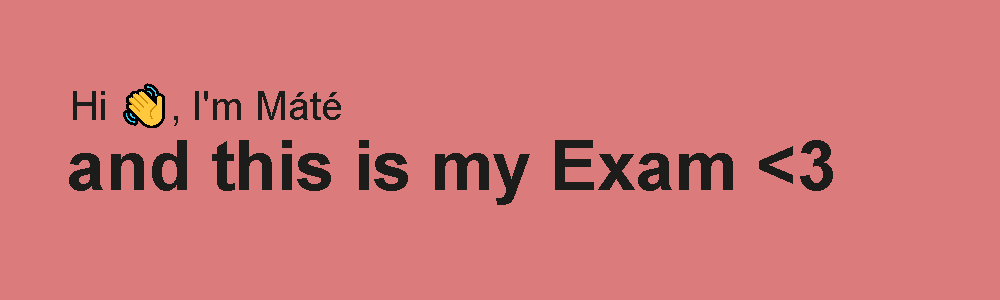
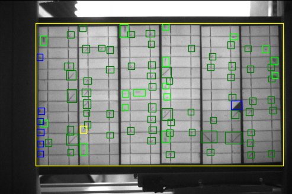
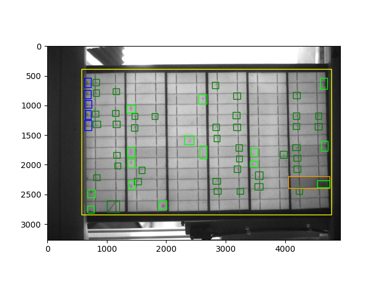
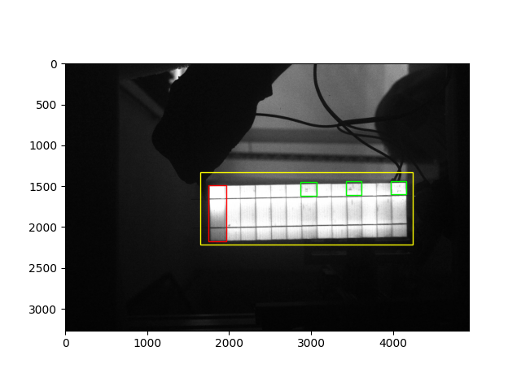
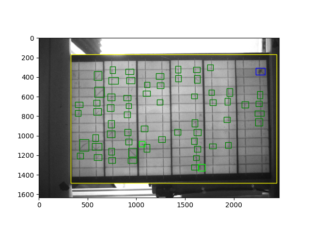

# softwaredevexam

## Table of contents
* [JSON Info](#json-info)
* [General info](#general-info)
* [Technologies](#technologies)
* [Setup](#setup)

## JSON Info
Mik is vannak a JSON-ben? Egyszerű szerencsére. Tartalmazza, hogy el van-e látva jegyzetekkel, ki jegyzetelt, És melyik képeken (képekre még visszatérünk), a jegyzetek pontossága és azok ID-ja.
Térjünk is vissza a Images részre, hiszen ez a legérdekesebb 😀
Hoztam is egy kis példakódot: 
```
.
.
.
{
  "ObjectIndex": 4,
  "Height": 0.04901081,
  "CenterY": 0.830822945,
  "CenterX": 0.397598863,
  "Width": 0.0310734455
},
.
.
.
```
Szóóóóóval, mi is mit jelent? Röviden: -> `ObjectIndex` az hiba fajtája, `Height` a négyzetünk magassága, `Width` a négyzetünk szélessége, `CenterX` és `CenterY` pedig ennek a szép XY koordinátája
Ezeket később használjuk is majd a kódban

```
posx = (CenterX*im.width) - ((Width*im.width)/2)
posy = (CenterY*im.height) - ((Height*im.height)/2)
.
.
.
rect = patches.Rectangle((posx, posy), Width*im.width, Height*im.height, linewidth=1, edgecolor=color, facecolor='none')
```           


## General info
<p align="center">
2021 Május 5.-én reggel tíz órakor nekiültem ennek a feladatnak, eleinte sok düh és még annál is több energiaital kellett, viszont büszke vagyok magamra, és arra amit képes voltam összehözni.

A program alapvetően amikor megnyílik akkor kér egy számot a felhasználótol, ami azt dönti el, hogy melyik képen fogjuk végrehajtani a folyamatot.
Az egész program nagyon szépen végigsuhan mind a 3 JSON fájlon és megnézi melyikben található  a mi általunk keresett képnek az adatai. Ezeket az adatokat felhasználva pedig négyzetekkel be is jelöli a hibákat a PDF-ben látható módon.

Miután végez a program a kép szerkesztésével, utána felugrik nekik egy ablakban (vicces módon az első található python képszerkesztőt használtam amit a kereső mutatott https://www.w3schools.com/python/matplotlib_intro.asp ugyanis ezt már ismerősökkel használtuk Párhuzamos Programozás órán is)






Természetesen nagyon könnyen hozzá lehet még adni másik képeket csak annyit kell tenni, hogy a main.py `imageChooser():` részébe hozzá kell adni opciókat még
PÉLDA:

<h4>imageChooser():</h4>

```
elif option == 5:
  return 'D210AABB3A20200185.jpg'
```
illetve ide is kell még egy opció

<h4>Menu():</h4>

```
print('5. D210AABB3A20200185.jpg')
```
és természetesen be kell húzni azt a képet a mappába

</p>

## Technologies
Project is created with:
* Python version: 3.8.7 :snake:
* pip: 21.0.1
* matplotlib 3.4.1


## Setup
To run this project, install a running enviroment for python.
First of all, we have to install Python from [here](https://www.python.org/ftp/python/3.9.2/python-3.9.2-amd64.exe).
Now we have to use python to download the modules that we need, mainly we are using matplotlib. 
Open up the python terminal and type in to download discordpy: `python -m pip install -U matplotlib`

If you happen not to have pip -> `python -m pip install -U pip` <- ez updateolni fogja majd a pip-ünket és remélhetőleg lehet majd látni
